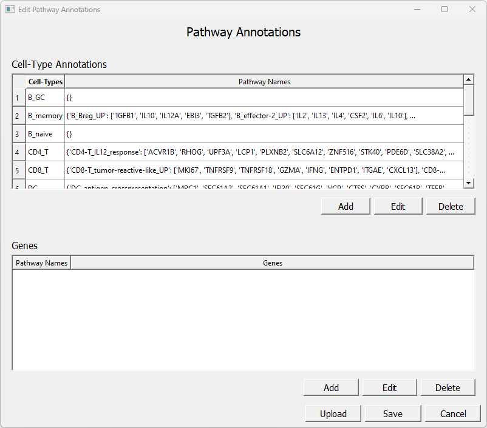

# SpectraGUI

A Graphical User Interface (GUI) to sit over top SPECTRA, a factor analysis tool developed in Dana Pe'er's Lab at Memorial Sloan Kettering Cancer Research Center (MSKCC).

This code was developed by Harvey Mudd students Sonia Bliss, Austin Froelich, Kate Phillips, and Brian Simpkins, in conjunction with Dr. Roshan Sharma of MSKCC.

## Installation

---

The first step in installing both SPECTRA and the associated GUI is to install the packages required for the code to run. To install a package, ensure you have Python installed (version 3.9 or later), and then execute the following command: `pip install {package_name}`. Alternatively, if you have Anaconda, you can use: `conda install {package_name}`.

### __SPECTRA dependencies__

These are all the required packages to use SPECTRA itself. Before running any code, make sure that these packages are installed and up to date:

- PyTorch (check out their [website](https://pytorch.org/get-started/locally/) to learn which version is best for you)
- Tqdm
- Collections
- Numpy
- Opt_einsum
- Scipy
- Pyvis

### __SPECTRA GUI dependencies__

These are all the required packages to use SPECTRA GUI. Before running any code, make sure that these packages are installed and up to date:

- Pyyaml
- Scanpy
- Numpy
- Pandas
- Seaborn
- Matplotlib
- PyQt5
- PyQtWebEngine

### __Downloading the code__

1. Find the SPECTRA git repository here: [github.com/dpeerlab/spectra](github.com/dpeerlab/spectra)

2. Find the green button that says “Code”. Click on it and select "Download Zip".

3. Copy the folder inside the zip file somewhere on your computer.

4. Now visit the SPECTRA GUI repository here: [https://github.com/HMC-Clinic-MSKCC-22-23/SpectraGUI](https://github.com/HMC-Clinic-MSKCC-22-23/SpectraGUI)

5. Download the zip and extract the folder somewhere on your computer. By default, the folders /SpectraGUI and /spectra are expected to be next to each other, but this isn't necessary.

6. Look in /SpectraGUI and open "config.yaml". After 'spectra_path:', paste the filepath pointing to the /spectra folder which you downloaded previously. If the folders /SpectraGUI and /spectra share the same parent folder, then the default path will work.

## Running the GUI

---

Once you are ready to open the GUI, open your command line. Navigate to the /SpectraGUI folder, and use the following command to run the GUI: `python SpectraGUI.py`. Alternatively, `python3 SpectraGUI.py` should do the same. If you use Anaconda, then the command `conda SpectraGUI.py` should also work. If you have all of the listed dependencies installed, then the first page to open should be the Input Page.

### __Input Page__

1. AnnData file path: Enter the file path to your annData object in the form of a .h5ad file.

2. AnnData key for cell type: Enter the cell type key that's specified in your AnnData set. Specifically, the key must index into the provided `annData.obs` to retrieve cell type information.

3. Pathway annotations: When you click 'Edit', a new window will open where gene pathway annotations can be inputted. See below for detailed instructions.

4. Lambda value: Input the desired lambda value. Check the SPECTRA git repository for more information about what this parameter affects.

5. Number of epochs: Input the number of training epochs for your model building process. Fewer epochs means faster runtime at the cost of model accuracy. 10,000 epochs is recommended for an accurate model.

6. Advanced options: Clicking 'Edit' opens a new window that provides additional options for SPECTRA. See below for more information.

7. Click "Run" when you're ready to train your model! The training process will begin immediately - check the terminal window for a progress bar.

### __Pathway Annotations__

There are several ways to input pathway annotations into the GUI. First, you can upload both .csv and .json files using the "Upload" button. The .csv file must be structured as follows: The first column lists the Cell Type name, and the second column indicates the Pathway name. The remaining columns are for the genes in the indicated pathway. Different pathways can have differing numbers of genes, and cell types can each have multiple pathways (one row per pathway). When the file has been selected, the upper box should populate with the given annotations. Here is an example:

Another way to input or modify pathway annotations is to use the "Add" and "Edit" buttons under the first box. This will open a new window with two input lines - the first input indicates the cell type, and the second details the pathways for that cell type. The structure of these pathways is as follows: {'pathway-1-name': ['gene1', 'gene2'], 'pathway-2-name': ['gene2', 'gene3']}. Here is an example:

If a cell type has multiple pathways, it can be useful to look at each pathway individually. To do this, double-click on the desired cell type in the upper box, which will populate the lower box. Here is an example based on the annotation we just added:

If you would like to edit any of these pathways or input new ones, use the "Add" or "Edit" buttons under the second box. A window will open with two input lines - the first input indicates the pathway name, and the second details the genes in that pathway. The structure of this entry is as follows: ['gene1', 'gene2', 'gene3']. Here is an example:

Finally, to save your inputs, press the "Save" button. Be careful! If the "Cancel" button is pressed, your changes will not be saved. This may be useful in the event of a mistake, but may also lead to some frustration.

### __Advanced Options__

The available options include the ability to 'use highly variable' genes; if your annData doesn't contain that information, or if you don't want to include it, then you can untick the box. Other options let you adjust values of rho, delta, and kappa. You can also enable gene weighting in the training process, and set the number of genes to report for each factor. The given defaults are recommended; see the SPECTRA repository for more information.

### __Output Screen__

1. UMAP: The plot on the left side is a UMAP projection of the provided annData. You can use the dropdown menu below to change which SPECTRA factors are used to color the figure. Use 'vmin' and 'vmax' to narrow the color scale, and adjust 'point size' to change the diameter of the plotted points. When you're ready, use the "Redraw UMAP" to apply your changes. If you would rather color the plot by genes, press the "Color UMAP by gene" button, enter the gene names in the input box, separating them by a comma, and press "Recolor UMAP".

2. Heatmap: The plot on the right side is a heatmap which plots the outputted SPECTRA factors against various other "obs" information included in the inputted annData. By default, all of the factors are included and are plotted against the provided cell types. The dropdown can be used to adjust the y-axis, and the "Add/Remove Factors" button can be used to change which factors appear on the x-axis.

3. Gene-Gene Graph: Click the button and a separate window will appear which can be resized in order to see the graph better. For more details on this visualization, see the SPECTRA repository.

4. Save options: Check the items that you want saved and click "Save". The associated data will be downloaded to /SpectraGUI.

5. Re-running the model: Click "Run Again" to go back to the input screen. Your parameters and pathway annotations will be remembered, but your trained model will be lost.
